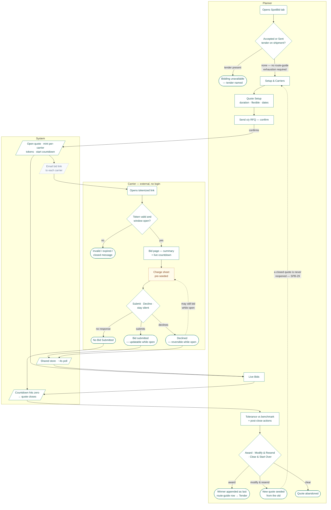
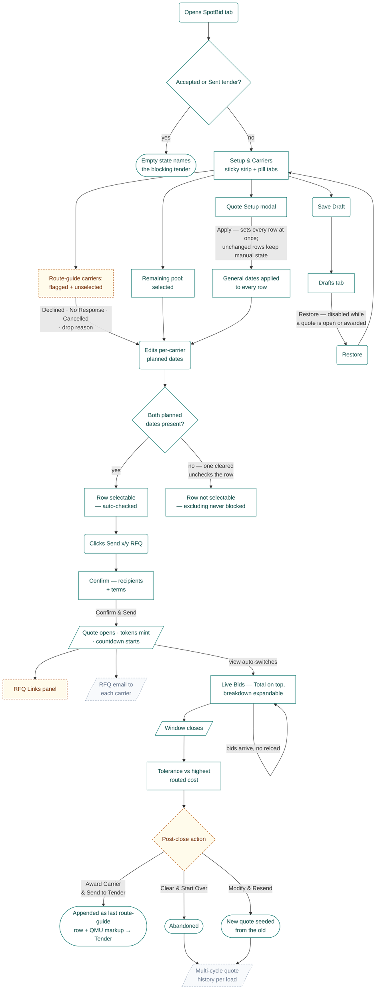
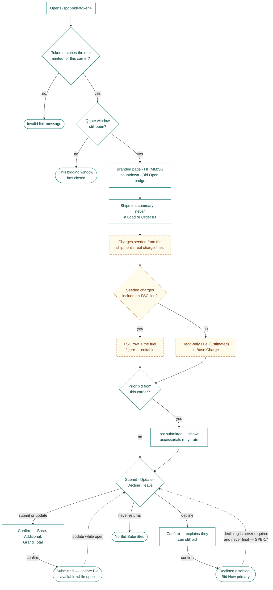
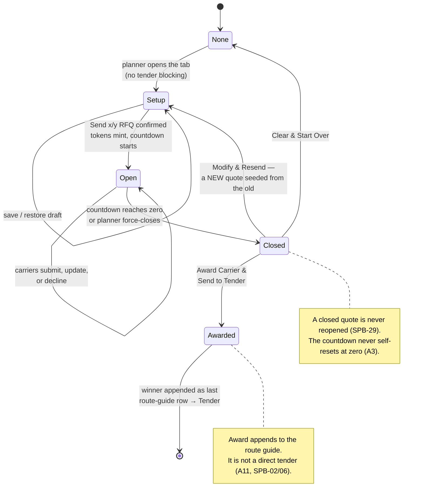

# SpotBid — flow

**Feature:** SpotBid — planner-initiated spot bidding
**Companion to:** [`spotbid-story-pack.md`](../story-packs/spotbid-2026-08-21/spotbid-story-pack.md) · screens in [`screens/`](../story-packs/spotbid-2026-08-21/screens/)
**Live:** `odyssey-one-stage.vercel.app/shipments` → open a spot-eligible shipment → **SpotBid** tab
**Status:** hand-authored pilot of the flow format ([design](../superpowers/specs/2026-08-24-flow-deliverable-design.md)). The generator will reproduce this file from `src/flows/spotbid.js`; the content below is what it must produce.

---

## How to read this

The story pack says *what* each behavior does. This file says *where it sits* — which screen leads to which, under what condition, and what happens when the condition fails. Nothing here restates a rule: every node cites the behavior IDs (`A1`–`A12`, `B1`–`B9`, `C1`–`C3`) that govern it, and those live in §2 of the pack.

**Node kinds** — `screen` (a state the user sees, has a screenshot) · `action` (the user does something) · `decision` (a branch; the condition rides on the arrow) · `system` (async or backend work) · `terminal` (an end state, including the unhappy ones).

**Build state** — this is the part a normal flow diagram omits, and the reason this one is worth reading:

| State | Drawn as | Means |
|---|---|---|
| `built` | solid | Live in the prototype. Behaves as drawn. |
| `stand-in` | amber, dashed | Built, but on a fake source. Must not harden into a requirement — see pack §4. |
| `not-built` | grey, dashed | Does not exist. Drawn in its rightful place so it can't be forgotten. |

**Source tags** carry the same vocabulary as the pack: `PRD` · `CALL <date>` · `SPB-NN` (vault decision log) · `LINX-NNNN` (Jira prior art) · `OURS` (our decision, awaiting ratification).

---

## 1. Overview — end to end

Both actors, happy path plus the branches that matter. This is the read for a PM.

| Node | Kind | Screen | Rules | Story | State | Source |
|---|---|---|---|---|---|---|
| Opens SpotBid tab | action | — | A1 | S1 | built | SPB-12 |
| Accepted or Sent tender? | decision | — | A1 | S1 | built | SPB-12, SPB-31 |
| Bidding unavailable | terminal | 01 | A1 | S1 | built | SPB-12 |
| Setup & Carriers | screen | 02 | A2, A4, A5 | S2, S3, S4 | built | CALL 08-07, OURS |
| Quote Setup | screen | 05, 06 | A6, A7 | S5 | built | CALL 08-07, SPB-59, SPB-60 |
| Send x/y RFQ — confirm | screen | 07 | A8 | S6 | built | SPB-61, OURS |
| Open quote · mint tokens · countdown | system | 08 | A3, A8 | S6 | built | SPB-61 |
| Email bid link to each carrier | system | — | — | **S7** | **not-built** | PRD §7.5 |
| Opens tokenized link | action | 11 | B1 | S12 | built | SPB-09, SPB-19 |
| Token valid and window open? | decision | — | B1 | S12 | built | SPB-09, PRD §6 |
| Invalid / expired / closed | terminal | 18 | B1 | S12 | built | OURS |
| Bid page — summary + countdown | screen | 11, 12 | B2, B3, B4 | S13 | built | SPB-05, SPB-22, OURS |
| Charge sheet pre-seeded | screen | 13 | B5, B6 | S14 | **stand-in** | OURS 08-21, SPB-55, SPB-56 |
| Submit · Decline · silent | decision | — | B7, B8 | S15, S16 | built | SPB-17, PRD §7.6 |
| Bid submitted | terminal | 17 | B7, B9 | S15 | built | PRD §7.6, SPB-38 |
| Declined | terminal | 16 | B8 | S16 | built | SPB-17, OURS |
| No Bid Submitted | terminal | — | A9 | S8 | built | SPB-17 |
| Shared store · ~4s poll | system | — | A10, C1, C2 | S17 | built | PRD §6, OURS |
| Live Bids | screen | 09 | A9, A10 | S8 | built | SPB-62, PRD §6 |
| Countdown hits zero | system | 08 | A3 | S2 | built | CALL 08-07, SPB-61 |
| Tolerance vs benchmark | screen | 09 | A11 | S9 | built | PRD, SPB-02, SPB-06 |
| Award · Modify · Clear | decision | 09 | A11 | S9, S10 | built | SPB-02/06/29, ⚠ SPB-63 |
| Winner → Tender | terminal | — | A11 | S9 | built | SPB-02, SPB-15 |
| New quote from old | terminal | — | A11 | S10 | built | SPB-29 |
| Quote abandoned | terminal | — | A11 | S10 | built | OURS |

---

## 2. Planner — SpotBid tab

| Node | Kind | Screen | Rules | Story | State | Source |
|---|---|---|---|---|---|---|
| Opens SpotBid tab | action | — | A1 | S1 | built | SPB-12 |
| Accepted or Sent tender? | decision | — | A1 | S1 | built | SPB-12, SPB-31 |
| Empty state names blocker | terminal | 01 | A1 | S1 | built | SPB-12 |
| Setup & Carriers | screen | 02, 04 | A2, A4 | S2, S3 | built | OURS, LINX-12067 |
| Route-guide carriers flagged | screen | 03 | A4 | S3 | **stand-in** | CALL 08-07 [27:52]; membership §4.3 |
| Remaining pool selected | screen | 02 | A4 | S3 | **stand-in** | OURS; membership §4.3 |
| Edits per-carrier dates | action | 02 | A5 | S4 | built | OURS, SPB-13 |
| Both planned dates present? | decision | — | A5 | S4 | built | OURS |
| Row selectable, auto-checked | screen | 02 | A5 | S4 | built | OURS |
| Row not selectable | screen | 02 | A5 | S4 | built | OURS |
| Quote Setup modal | screen | 05 | A6, A7 | S5 | built | CALL 08-07, SPB-59, SPB-60 |
| General dates applied | screen | 06 | A6 | S5 | built | OURS |
| Clicks Send x/y RFQ | action | — | A8 | S6 | built | OURS |
| Confirm recipients + terms | screen | 07 | A8 | S6 | built | SPB-61, OURS |
| Quote opens, tokens mint | system | 08 | A3, A8 | S6 | built | SPB-61 |
| RFQ Links panel | screen | 08 | A8 | S7 | **stand-in** | §4.1 — stands in for the email |
| RFQ email | system | — | — | **S7** | **not-built** | PRD §7.5 |
| Live Bids | screen | 09 | A9, A10 | S8 | built | SPB-62, SPB-17, PRD §6 |
| Window closes | system | 08 | A3 | S2 | built | SPB-61 |
| Tolerance vs benchmark | screen | 09 | A11 | S9 | built | PRD |
| Post-close action | decision | 09 | A11 | S9, S10 | **stand-in** | ⚠ SPB-63 wants radio + single action; §4.8 |
| Award → Tender | terminal | — | A11 | S9 | built | SPB-02, SPB-06, SPB-15 |
| New quote from old | terminal | — | A11 | S10 | built | SPB-29 |
| Abandoned | terminal | — | A11 | S10 | built | OURS |
| Multi-cycle history | system | — | C3 | S10 | **not-built** | PRD §6 — gap |
| Save Draft | action | 10 | A12 | S11 | **stand-in** | OURS — not in PRD, needs ratification |
| Drafts tab | screen | 10 | A12 | S11 | **stand-in** | OURS |
| Restore | action | 10 | A12 | S11 | **stand-in** | OURS |

**Branch conditions worth naming for a developer.** Entry is gated on tender state alone, never on route-guide exhaustion (`A1`, SPB-12) — the most common wrong assumption. Inclusion is asymmetric: a row can only be *included* with both planned dates, but *excluding* is never blocked (`A5`). The general dates in Quote Setup write to every row at once and clearing them clears every row, but rows whose dates would not change are left untouched, so a deliberately-unchecked carrier is never silently re-included (`A6`).

---

## 3. Carrier — tokenized bid page

| Node | Kind | Screen | Rules | Story | State | Source |
|---|---|---|---|---|---|---|
| Opens tokenized link | action | 11 | B1 | S12 | built | SPB-09, SPB-19 |
| Token matches carrier? | decision | — | B1 | S12 | **stand-in** | guard OURS; §4.2 — no server-side expiry |
| Invalid link message | terminal | 18 | B1 | S12 | built | OURS |
| Window still open? | decision | — | B1 | S12 | built | PRD §6 |
| Window closed message | terminal | 18 | B1 | S12 | built | OURS |
| Branded page + countdown | screen | 11 | B3 | S13 | built | PRD §7.7; presentation OURS |
| Shipment summary | screen | 12 | B2, B4 | S13 | built | SPB-05, SPB-51, SPB-22, SPB-60 |
| Seeded charge sheet | screen | 13 | B5 | S14 | **stand-in** | OURS 08-21; catalog SPB-55, §4.4 |
| FSC line present? | decision | 13 | B6 | S14 | **stand-in** | ⚠ SPB-56 vs OURS — §4.5, needs a ruling |
| Editable FSC row | screen | 13 | B6 | S14 | **stand-in** | OURS 08-21 |
| Read-only Fuel (Estimated) | screen | 13 | B6 | S14 | **stand-in** | SPB-56 |
| Prior bid? | decision | 17 | B7, B9 | S15 | built | PRD §7.6, SPB-38 |
| Rehydrated prior bid | screen | 17 | B7, B9 | S15 | built | SPB-38 |
| Submit · Update · Decline | decision | — | B7, B8 | S15, S16 | built | SPB-17 |
| Submit confirmation | screen | 14 | B7 | S15 | built | OURS |
| Submitted | terminal | 17 | B7 | S15 | built | PRD §7.6 |
| Decline confirmation | screen | 15 | B8 | S16 | built | OURS 08-21 |
| Declined | terminal | 16 | B8 | S16 | built | SPB-17, OURS |
| No Bid Submitted | terminal | — | A9 | S8 | built | SPB-17 |

**Branch conditions worth naming for a developer.** The token check is two guards, not one — identity (does this token match the one minted for this carrier) and window (is the quote still open). They fail to different messages. Declining is reversible and never required: silence and an explicit decline are different states downstream (`No Bid Submitted` vs `Declined`), and a declined carrier can re-enter the bid flow while the window is open (`B8`, SPB-17). The fuel branch is the one place the prototype and the decision log disagree — `SPB-56` says fuel is precalculated and not carrier-editable, the build makes a seeded FSC row editable. Both sides are drawn because the ruling has not been made.

---

## 4. Quote lifecycle

The state machine behind both surfaces. Drawn separately because two rules are the ones most likely to be built wrong from prose: a closed quote is immutable, and re-quoting creates a new instance rather than reopening the old one.

| State | Entered by | Rules | Story | Notes |
|---|---|---|---|---|
| None | initial, or Clear & Start Over | A11 | S10 | Drafts survive; the quote does not. |
| Setup | opening an unblocked tab, or Modify & Resend | A2, A4–A7, A12 | S2–S5, S11 | The only state where drafts can be saved or restored. |
| Open | Send RFQ confirmed | A3, A8–A10, B1–B9 | S6, S8, S12–S16 | The only state where carriers can act. |
| Closed | countdown zero, or force close | A3, A9, A11 | S8, S9 | Immutable. Silence resolves to `No Bid Submitted`. |
| Awarded | Award & Send to Tender | A11 | S9 | Terminal for SpotBid; hands off to the Tender flow. |

Multi-cycle history across `Modify & Resend` cycles is **not built** (`C3`, PRD §6) — the prototype keeps only the current quote. Story `S10` carries it.

---

## 5. Story coverage

Every story in pack §3 must appear on the flow or be excused here in writing. This is the check that turns the flow into a coverage report.

| Story | Appears as | State |
|---|---|---|
| S1 Tab availability | eligibility gate + blocked terminal | built |
| S2 Context strip | Setup & Carriers, countdown, window close | built |
| S3 Derived carrier list | routed-flagged + pool nodes | stand-in (membership) |
| S4 Dates & inclusion | dates decision + selectable/not-selectable | built |
| S5 Quote Setup | modal + applied | built |
| S6 Send RFQ | confirm + quote opens | built |
| **S7 Carrier email** | **RFQ email node** | **not-built** |
| S8 Live Bids | Live Bids + No Bid Submitted | built |
| S9 Award | tolerance, post-close action, award terminal | stand-in (interaction ⚠ SPB-63) |
| S10 Re-quote lifecycle | lifecycle diagram + history node | partly not-built (history) |
| S11 Drafts | save / drafts tab / restore | stand-in (needs ratification) |
| S12 Token access | token + window guards, both terminals | stand-in (no server expiry) |
| S13 Bid page | branded page + summary | built |
| S14 Charge sheet | charges + fuel branch | stand-in (catalog, fuel ⚠) |
| S15 Submit / update | prior-bid branch, confirm, submitted | built |
| S16 Decline | confirm, declined, reversal edge | built |
| S17 Persistence & sync | shared store · ~4s poll (overview) | built (last-write-wins, C2) |

**Unmapped, with reason:** `S18 — Configuration` has no node. Duration defaults, flexible-variance days, the charge catalog, and carrier-list profiles are configuration behind four different nodes rather than a step anyone walks through. It is the story where the stand-ins below become real.

**Not in pack §3 and not on the flow:** PRD §7 story 4 (Ops-manager monitoring queues) and story 8 (notify on all-decline / no-bids) are unbuilt and unsliced. Story 8 belongs on this flow the moment it is sliced — it hangs off `Window closes`.

---

## 6. What the flow makes visible

The dashed nodes, collected. Nothing here is new information — all of it is in pack §4 — but on the flow it sits where a developer will actually walk into it.

**Not built at all.** The RFQ email (`S7`) — a core V1 deliverable sitting on the critical path between the planner confirming and the carrier ever learning a quote exists; the prototype's RFQ Links panel is a hand-off stand-in, not a feature. Multi-cycle quote history (`C3`, `S10`).

**Built on a fake source.** Overflow carrier membership is a deterministic sample of the carrier master standing in for OCM carrier-list profiles (§4.3). The charge catalog is the shipment's routing rate lines plus a static code list, standing in for the OCM COFL Charges profile (§4.4). Fuel is the shipment's AP figure (§4.5). Drafts are ours and unratified (§4.12 / `A12`). Token guarding has no server-side expiry (§4.2).

**Contested, drawn both ways.** The fuel branch (`SPB-56` vs the build) and the post-close award interaction (`SPB-63`'s radio-select and single action vs the built per-row buttons). Neither has a ruling; the flow shows the fork rather than picking a side.

---

*Hand-authored 2026-08-24 against the story pack of 2026-08-21 and the built prototype (sessions 126–130). Screens live in `../story-packs/spotbid-2026-08-21/screens/`. Behavior rules `A*`/`B*`/`C*` live in §2 of the pack; decision IDs `SPB-NN` resolve in `vault/10-domains/spotboard/decisions/decision-log.md`.*
