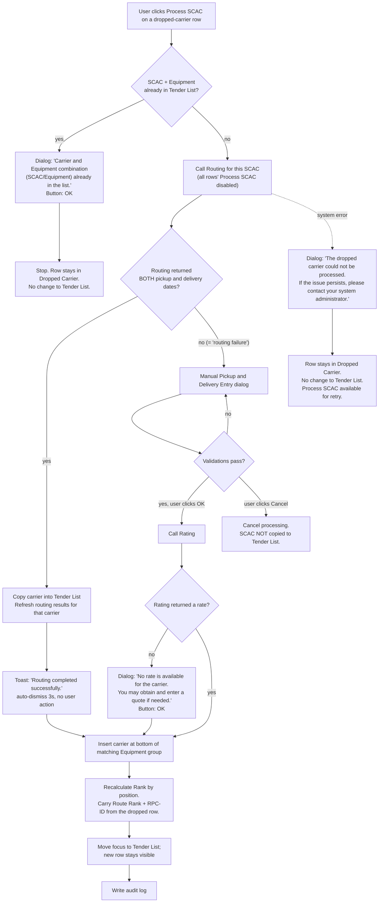

# Dropped Carrier

Canon for the **Dropped Carrier** section of the Tender tab and the **Process SCAC** action that
promotes a dropped carrier into the Tender List.

**LINX-13953 (Display) and LINX-13954 (Process SCAC) are now built in the prototype** — see the ✅ markers
through §3–§4. Ticket workflow status in Jira is unchanged for all three (`Initial UX/UI Design` / `New`);
none carries `Approved` or `Refinement_done`. LINX-13397 (data lookups) remains unimplemented — see §5.
This document mixes shipped behaviour with unresolved analysis; each subsection says which. See
[[decisions/dropped-carrier-decisions|Dropped Carrier Decisions]] for the rulings, which use a `DC-`
prefix precisely so they are never mistaken for the ticket's own spec — implemented or not — in
[[decisions/decision-log|the Shipments decision log]].

## Sources

| Source | What it is | Weight |
|---|---|---|
| **LINX-13953** — Tender Tab - Display Dropped Carrier | Settled written spec (AC, rev. 2026-08-11 09:10) | the rules |
| **LINX-13954** — Tender Tab - Process SCAC | Settled written spec (AC) | the rules |
| **LINX-13397** — TMS Master Data Lookup Queries & Functions | Settled written spec, 11 lookups | the data |
| **Jana call, 2026-08-11** (`jana-tender-drop-carrier-and-process-scac-2026-08-11.vtt`) | Jana's spoken intent, walking the TMS screens live with Manuela + Efrain | the *why*, and the placement/interaction rules the AC never states |
| **Rovo, 2026-08-26** (`rovo-scac-definition-2026-08-26.md`) | Atlassian AI summarising LINX-13954 + tech design; relayed by Manuela | corroborating only — an AI reading of tickets we already hold verbatim. Contains one confirmed error (§1 *What a SCAC is*) |

Verbatim AC lives at `vault-sources/10-domains/shipments/sources/linx-dropped-carrier-ac-2026-08-17.md`.
Timestamps below (`[mm:ss]`) point into the VTT. Where the two disagree, both positions are quoted and
the disagreement is left open — see [Open questions](#open-questions).

---

## 1. What a dropped carrier IS

Read this section first if the term is new.

When a shipment is created, Odyssey One calls the **routing service**. Routing evaluates every carrier
that could plausibly haul this load and splits them into two lists, which come back in the same payload:

- **usable carriers** — carriers that qualified. These become the **Tender List** (the routing-options
  table you already see on the Tender tab).
- **drop carrier list** — carriers that were *eligible* for the shipment but **failed a qualification
  check**, so routing excluded them from the first cut.

> *"It evaluated 10 carriers, right? Out of that, only four qualified. There could be 6 in the drop
> carrier list. So they did not meet the requirements."* — Jana `[02:07]`

> *"There are some carriers which did not make to this list, usable carrier list. That's called the drop
> carrier list."* — Jana `[03:44]`

**The dropping is automatic and happens outside Odyssey One.** Routing decides; we render.

> Manuela: *"So that that that is automatic."* — Jana: *"Automatic. We don't have to do anything."*
> `[05:59]`

### Why routing drops a carrier

Routing returns a **Reason** per dropped carrier. Reasons Jana named on the call:

- **Prohibited** — the carrier is barred for this lane/customer.
- **No rates found** — no contracted rate exists.
- **Missing transit time** — routing could not compute the schedule.

The worked example Jana walked through is the clearest illustration of the whole concept:

> *"It had a delivery date, but it could not calculate the pickup date because it did not have a transit
> time."* … *"If you know the transit time as two days, you already know the delivery date, but you can
> calculate the pickup date. Since the transit time was not available, it could not calculate the pickup
> date, and that is why it dropped out of the list."* — Jana `[05:24]`–`[05:52]`

So the carrier was not *bad*. It was **unschedulable with the data routing had**. That distinction is the
whole point of the feature.

### What decision the screen supports

A dropped carrier may still be the right carrier. The planner looks at the dropped list and asks:
*"is this exclusion a real disqualification, or just a data gap I can fill?"*

- **Prohibited** → leave it dropped.
- **Missing transit time** → the planner can supply the pickup/delivery dates by hand and the carrier
  becomes tenderable.
- **No rates found** → the planner can process it anyway and enter a quote for it afterwards.

**Process SCAC** is the action that acts on that judgement: it takes one dropped carrier, re-runs routing
(and rating), collects any missing dates from the user, and puts the carrier into the Tender List where
it can be rated, quoted and tendered like any other option.

> *"We have a carrier and we would want to move this carrier from a drop carrier list to the usable
> carrier list. … I want to take this carrier and move it here, right? I want to use it. How can I use
> it? So I would select this carrier. And then process SCAC."* — Jana `[12:22]`

### What a SCAC is

**Standard Carrier Alpha Code** — a 2–4 letter identifier assigned to a carrier by the **NMFTA**
(National Motor Freight Traffic Association). It is the freight industry's carrier primary key: it
travels on EDI messages, bills of lading and rate tables so two systems can agree on *which carrier*
without matching names. In Odyssey One it is the identifier a carrier is known by across routing,
rating, tendering, volume commitments and the LINX-13397 OCM profile lookups — which is why the action
is called **Process SCAC** and not *Process Carrier*: the SCAC (paired with Equipment) is the thing
being processed. The same pairing is what the duplicate check keys on — see §4.3.

Seeded codes in the prototype are real: `ODFL` Old Dominion, `JBHT` J.B. Hunt, `EXLA` Estes Express,
`XPOL` XPO, `FXFE` FedEx Freight Economy (`apps/odyssey-one/tools/generate.mjs:173`).

**Odyssey's own brokerage desks carry SCACs too.** `CTNS` is Odyssey's internal brokerage —
corroborated independently in [[../spotboard/data/quote-model|the SpotBoard quote model]] (*"Odyssey's
CTNS brokerage team"*), and seeded here as `CONTINENTAL TRANSPORTATION`. Rovo additionally names `ARIT`
(Flatbed) and `ODLD` (Bulk) as internal SCACs split by mode, with `CTNS` as TL/Dry. ⚠️ **Unverified** —
neither `ARIT` nor `ODLD` appears anywhere else in the vault or in the seed. Confirm with Jana before
either is treated as canon or seeded.

> ⚠️ **Rovo's one error, recorded so it is not re-imported.** Rovo defines Process SCAC as
> *"moving a carrier from the Dropped Carrier section into the active Tender List."* **It is a COPY, not
> a move** — the dropped row remains in both lists. Jana, 2026-08-17: *"yes shows in both, that's why he
> said copy and add."* See [[questions-for-jana-2026-08-17|Q3]] and [[#OQ-10|OQ-10]]. The AC
> itself invites the mistake: it says *"copied"* five times (lines 171, 172, 229, 244, 351) and
> *"moved"* once (line 291). We made the same inference from the same absence and were corrected — it
> is not cosmetic, because *move* would force the system to persist that a carrier had been processed,
> which is the storage change [[decisions/dropped-carrier-decisions#DC-18|DC-18]] records we did not need.

### Terminology

| Ours / ticket | Jana says | Routing payload says | TMS UI |
|---|---|---|---|
| Dropped Carrier | "drop carrier", "drop carrier list" | `drop carrier list` | a **Drop Carrier button** opening a separate screen |
| Tender List | "usable carrier list", "the main list" | `usable carriers` | the routing-options grid |

Canon spelling follows the tickets: **Dropped Carrier**, **Tender List**. See [[decisions/dropped-carrier-decisions#DC-11|DC-11]].

---

## 2. Where it lives

**Inline, directly below the Tender List, inside the Tender tab, as a collapsible section.** This is the
VTT's contribution — 13953's AC only ever says "the Dropped Carrier section" and never places it.

> *"Underneath this tender list, we'll need a drop carrier list."* `[00:41]`
> *"We want to keep it below this particular list. It will have very similar kind of field."* `[01:31]`
> *"The idea is this is the tendering list and below that you will have a drop carrier list."* `[01:42]`

TMS puts it behind a button on its own screen. Odyssey One deliberately does not:

> *"Here, just below in TMS, it has a separate screen. You want to just provide it below the screen
> itself."* … *"Drop carrier, you have to have it as some kind of an idea, right? So it should be
> collapsible, click, it should open, then it should give you all the entire list, right? … so that the
> user can see and see the list, first of all."* — Jana `[06:51]`–`[07:15]`

Ruling: [[decisions/dropped-carrier-decisions#DC-01|DC-01]].

**Size.** Not fixed. Jana: *"the second list we can have two, can have one, it is going to be based on
routing, what the routing had returned"* `[01:58]`. Efrain's *"there are so many carriers on this second
list"* `[01:49]` was answered with the 10-evaluated / 4-qualified / 6-dropped example — so the section
must survive both an empty state and a list longer than the Tender List above it.

**Field similarity.** *"It will have very similar kind of field"* `[01:35]` is literal — most Dropped
Carrier fields already exist as columns in the routing-options table documented in
[[domain-analysis#routing-options--full-column-set|domain-analysis]]:

| Dropped Carrier field | Already a Tender List column? |
|---|---|
| Route Rank, SCAC, Carrier Name, Equipment | yes (Rank, SCAC, Carrier Name, Equipment) |
| Pickup/Delivery Date/Time, Transit Time | yes |
| Route Group, TT ID, RPC-ID, Indirect Point, Order equipment | yes (Route Group, TT ID, RCP ID, Indirect Point, Order Equip) |
| Transit Source | yes (Transit Time Source) |
| **Start Date, Stop Date** | **no — new** |
| **Reason, Reason description** | **no — new, and unique to this section** |

*(Inference: the mapping is mine, from column names; no source states it. It matters because it means
the section is a re-skin of an existing row shape plus two exception fields, not a new data surface.)*

---

## 3. Display spec — LINX-13953

### 3.1 Carrier fields

Verbatim from the AC (rev. 2026-08-11). "Logic / Data" is the ticket's own column.

| Field | Example | Logic / Data |
|---|---|---|
| Route Rank | 1 | returned by Routing |
| SCAC | JBHT | returned by Routing |
| Carrier Name | J.B. Hunt | **lookup by SCAC** → [13397 §2](#5-data-dependencies--linx-13397) |
| Equipment Type | LTL | returned by Routing |
| Pickup Date/Time | 08/20/2025 14:00 CST, Wed | returned by Routing *(if returned)*. **Org hrs are not required.** |
| Delivery Date/Time | 08/22/2025 09:00 PST, Fri | returned by Routing *(if returned)*. **Org hrs are not required.** |
| Start Date | 08/20/2025 | **lookup by RPC-ID** → 13397 §7 |
| Stop Date | 08/22/2025 | **lookup by RPC-ID** → 13397 §7 |
| Transit Time | 2 DY or 10 HRS | returned by Routing *(if returned)* |
| Transit Source | PCMILER | returned by Routing *(if returned)* |
| Route Group | EAST-01 | **lookup by RPC-ID** → 13397 §8 |
| Reason | Missing Transit Time | primary reason the carrier was dropped, returned by Routing |
| 🔴 Reason description | Transit time could not be calculated due to missing transit or distance data | detailed explanation. "Lookup in the Master table. Refer story for the code" — **but 13397 has no such lookup.** See [OQ-2](#oq-2). Ticket still red-flags this as *"require code from Dave"*. |
| RPC-ID | 3913973 | returned by Routing |
| Order equipment | checkbox | checked if SCAC **and** Equipment match the SCAC passed in on the Order |
| Indirect Point | checkbox | as passed in on Routing. `Y`=checked, `N`=unchecked, **not returned = unchecked** |
| TT ID | 10901692 | returned by Routing *(if returned)* |

Note the asymmetry the AC creates deliberately: **Indirect Point falls back to unchecked**, while every
other absent field falls back to `--`.

The 2026-08-11 revision added `RPC-ID`, `Order equipment`, `Indirect Point`, `TT ID`, and loosened
Pickup / Delivery / Transit Time / Transit Source with *"(if returned by Routing)"*. Reading: as of the
last revision Jana expected **more** of this payload to be optional than they originally did.

### 3.2 Volume Commitment fields

**The display fields are in scope. The Accepted/Open *calculation* is not.** Jana split those two apart
herself on the call — see [[decisions/dropped-carrier-decisions#DC-06|DC-06]].

| Field | Example | Logic / Data |
|---|---|---|
| Commitment | 10 or 10,000 | get via CVC ID → 13397 §10 + §11 |
| UoM | Loads/Week, KG/Day | AC says *"returned by Routing"* and also *"returned as part of commitment"* — contradictory, see [OQ-4](#oq-4) |
| Accepted | 6 Loads | calculated commitment utilisation — **rules pending Dave** |
| Open | 4 Loads | remaining commitment capacity — **rules pending Dave** |
| Comment | Carrier commitment notes | `cvc_comment` (13397 §11) |
| CVC ID | CVC12345 | AC: returned by Routing per carrier. 13397 §10 derives it. See [OQ-3](#oq-3). |

**What a commitment is,** in Jana's words:

> *"The idea behind volume commitment is for this particular carrier, what is my weekly volume of trucks
> that they are going to give? … Commitment means it is like carrier has agreed to do 10 loads per week.
> And how many they have accepted so far for this week? … they have accepted 6 loads. This will be
> calculated as a commitment utilization. And open is remaining commitment capacity. … 10 minus 6, which
> is 4."* — Jana `[08:43]`–`[09:45]`

**Why CVC ID is a per-row field and not a section header** — the single most useful thing the VTT says
about commitments:

> *"Every SCAC will have its own CVC ID … that is why I have CVC ID as one of the information in the
> list. But here you would see it as if like it is applicable for the entire drop carrier list, but it is
> actually applicable for each and every option of the drop carrier list."* — Jana `[11:03]`

> *"For this rule number one, for this particular carrier and the equipment, the carrier is committed for
> 10 loads. For a different equipment, they might have committed a different number of loads. That is why
> this rule is important."* — Jana `[10:20]`

So the commitment is keyed on **(carrier, equipment, week)**, not on the shipment. A layout that hoists
commitment to the section header is wrong; it belongs on the row. This is a genuine design trap the AC's
flat table does not signal.

**Deferral, in Jana's words:**

> *"There's another tab called Volume Commitment, right? I want to move this to a separate story. Because
> Dave needs to give me some rules behind it, how to calculate what needs to be done. So what he said was
> that is very difficult. There is a lot of codes … You don't have to work on this one right now."*
> `[07:50]`–`[08:32]`

…immediately followed by the part that keeps the display in scope:

> *"Or even if you want, you can just put the fields and just keep it, whatever information what we
> have."* … *"You just maybe just plug this information as part of the design … we might need some
> refinement on this particular logic. **I think it's more the logic refinement, not the display
> refinement.**"* — Jana `[08:36]`, `[11:57]`

Note: **the split never happened.** The AC as pulled on 2026-08-17 still carries the Volume Commitment
table inside 13953, and the same 2026-08-11 revision *resolved* the Commitment TBD in favour of CVC-ID
lookup rather than removing it. See [[decisions/dropped-carrier-decisions#DC-07|DC-07]].

### 3.3 Display rules

- The section shall display **all** dropped carrier options returned by Routing (no filtering, no cap).
- Pickup Date/Time and Delivery Date/Time each display **Date + Time + Time Zone + Day of Week**.
  (Example format in the AC: `08/20/2025 14:00 CST, Wed`.)
- Origin/destination **operating hours are explicitly not required** here — so 13397 §5
  (`mf$org.get_workday_info`) is *not* a dependency of this screen.

### 3.4 Commitment rules

- Commitment information displays when available.
- **Accepted** and **Open** are calculated **only when Commitment AND UoM are both available.**
- Missing Commitment, or missing UoM, or both → Accepted and Open display `--`.
- **A CVC ID alone does not trigger the calculation.** If CVC ID exists but Commitment or UoM does not,
  Odyssey One shall not calculate Accepted or Open.

### 3.5 Null handling

> If Routing does not return a value for **any** field displayed within the Dropped Carrier section,
> Odyssey One shall display `--`.

(Exception: Indirect Point, which falls back to unchecked — §3.1.)

### 3.6 Refresh

> Dropped Carrier information shall refresh whenever Routing Options are refreshed.

AC-only; the VTT does not discuss refresh. What a refresh does to a carrier the user already processed is
unspecified — [OQ-9](#oq-9).

---

## 4. Process SCAC — LINX-13954

**✅ Built** 2026-08-17. Commits `7367759`, `8bffdf1`, `006d3ce`, `14d1bfd`, `033576d`, `c29410f`. The
sections below describe the AC/VTT-derived spec; §4.14–§4.16 record what building it actually required
beyond that spec — see [[decisions/dropped-carrier-decisions#DC-12|DC-12]] through
[[decisions/dropped-carrier-decisions#DC-21|DC-21]] for the full implementation-call record.

### 4.1 Where the action lives

**One action per dropped-carrier row — not a single button above the section.** The AC only says the
action "shall only be available for carriers displayed within the Dropped Carrier section"; the VTT is
what settles the placement, and Jana was emphatic and unprompted about it:

> *"Process SCAC should not be like here in the drop carrier list, and you have a drop carrier list. Each
> drop carrier list option should have this action button, where they would select and process the SCAC
> **instead of just having one button on the top** to say like Process SCAC. We should have for every
> option which is dropped to process the SCAC from here to the usable list."* — Jana `[21:31]`–`[21:56]`

Ruling: [[decisions/dropped-carrier-decisions#DC-02|DC-02]] — ✅ implemented (action column); see
[[#OQ-14|OQ-14]] for a layout issue it introduced.

### 4.2 Concurrency

- Only **one** SCAC may be processed at a time.
- While processing: Process SCAC is disabled **for the current SCAC and for every other dropped-carrier
  row**, and additional clicks are not accepted.

> *"It means that the button should not be enabled for second carrier processing."* — Jana `[17:47]`

### 4.3 The flow



*Diagram notes (inference, flagged):* the AC lists **Duplicate Carrier Validation** after Rating but says
*"Before processing the carrier"* in its own first line — so it is drawn as the first gate. The AC also
places the rating call **only** on the routing-failure branch, which is drawn faithfully above and is
exactly what the VTT contradicts — see **[OQ-1](#oq-1)**, the most consequential open item in this
document.

**Built as drawn**, 2026-08-17 — with the addition of [[decisions/dropped-carrier-decisions#DC-12|DC-12]]
(Routing/Rating simulated off the seeded `dropCode`) and
[[decisions/dropped-carrier-decisions#DC-15|DC-15]] (the success/failure messages render as an `Alert`,
not the "Toast" node this diagram's own label uses).

### 4.4 Routing success

Condition: routing completes **and** pickup and delivery dates are both available.

- Carrier information is **copied** from the Dropped Carrier section into the Tender List.
- Routing results are refreshed for the copied carrier.
- Message: **"Routing completed successfully."** — disappears after **3 s**, no user action.

### 4.5 Routing failure

**"Routing failure" here does not mean the service errored.** It means routing came back without usable
dates. Both sources agree, and the VTT states it in so many words:

> *"When it is calling the routing service, it is trying to calculate the date for the carrier. If it is
> not able to calculate the date, it would ask the user to fill a date, right? **That is what I am calling
> as a routing failure.**"* — Jana `[19:04]`

The AC's own Manual-Entry precondition says the same thing more explicitly than its pseudocode does:
*"Routing fails (Routing call successful but didn't return Pickup or Delivery or both dates)"*.

A genuine transport/system error is a **different** branch → §4.10 Processing Failure.

Ruling: [[decisions/dropped-carrier-decisions#DC-03|DC-03]].

### 4.6 Manual Pickup and Delivery Entry

Required **only** when routing succeeded but did not return pickup and/or delivery dates.

**Fields:** Pickup Date/Time, Delivery Date/Time.

**Validations** — both block progress, both render **under the offending field**:

| Condition | Message |
|---|---|
| Delivery Date/Time ≤ Pickup Date/Time | *"Delivery Date/Time must be later than Pickup Date/Time."* |
| Pickup Date/Time in the past | *"Pickup Date/Time cannot be in the past."* |

**Buttons: OK / Cancel.** OK is enabled only once validations clear.

> *"It should give a button saying that okay and cancel, and okay is continue processing, and **okay
> should be enabled only when this validation message is gone**, right? When they have corrected that the
> delivery date is greater than the pickup date."* — Jana `[35:37]`

| Response | Result |
|---|---|
| OK | continue processing |
| Cancel | cancel processing; SCAC **not** copied into the Tender List |

⚠️ The AC says twice *"once above validations are complete, then **Yes** button activated"* while its own
button tables say **OK / Cancel**. Treat "Yes" as a leftover — [[decisions/dropped-carrier-decisions#DC-08|DC-08]].

The delivery≤pickup rule has full VTT backing (`[34:39]`–`[35:12]`, with Jana's 07:27-vs-07:28 worked
example). **The pickup-in-the-past rule is AC-only** — no rationale anywhere in the VTT. See [OQ-6](#oq-6).

✅ **Implemented** 2026-08-17 (`ManualDatesModal`, commit `14d1bfd`) — both validations browser-verified,
see [[decisions/dropped-carrier-decisions#DC-21|DC-21]].

### 4.7 Rating failure

- Message: **"No rate is available for the carrier. You may obtain and enter a quote if needed."**
  Button: **OK**.
- **Rating failure does not block the carrier from entering the Tender List.** The user acknowledges and
  processing continues.

The intent behind the message — it is a *nudge toward the Quote flow*, not an error:

> *"It should tell a message to the user saying that, oh, hey, you need to fill a quote. How do you fill a
> quote? You go here, go to the quote tab, and then enter a quote."* — Jana `[20:40]`

> *"You need to fill a quote for it **because you should not leave it empty**. That's the reminder.
> That's all I'm trying to say."* — Jana `[27:34]`

An option landing in the Tender List with an empty cost is the failure mode Jana is designing against.
Related shipped work: the Quote group (LINX-13894/13895/13896/13897), shipped in session 121 — see
[[decisions/decision-log#DEC-103|DEC-103]].

### 4.8 Duplicate carrier validation

Before processing, validate whether the same **SCAC + Equipment** combination already exists in the
Tender List. If it does:

- Message: **"Carrier and Equipment combination (SCAC/Equipment) already in the list."** Button: **OK**.
- Processing stops. The carrier/option **remains** in the Dropped Carrier section. No change to the
  Tender List.

Jana reproduced this in TMS live: *"it is going to say carrier and equipment combination, RLCA and LTL
already exist in the list … it is going to give a warning message. So that also needs to be covered."*
`[17:14]`

The key is the **compound** key: the same SCAC on a *different* equipment is not a duplicate.

### 4.9 Carrier insertion

- Insert at the **bottom of the matching Equipment group**.
- If no matching Equipment group exists, insert at the **end of the Tender List**.
- **Rank** is recalculated from the carrier's position in the Tender List.
- **Route Rank logic** (AC, verbatim):

```
If adding from the dropped carrier list
    Use the route rank from the dropped carrier list
    Use the RPC-ID from the dropped carrier list
Else (i.e. adding it "from scratch" on the tendering screen) - 🔴 Refer Story xxxx
    Leave the route rank empty
    Leave the RPC-ID empty
End if
```

**Rank and Route Rank are two different things,** and Jana interrupted their own reading of the AC to say
so:

> *"The rank shall be calculated — route rank logic. Okay, this is a route rank logic. **It is not about
> this one, right? This is not about this.** This is a route rank logic. How to do the route rank?"*
> — Jana `[37:44]`

So: **Rank** = the carrier's position in the Tender List, recalculated on insert. **Route Rank** =
routing's own rank, carried over from the dropped row together with its RPC-ID (or left empty on the
manual path). Ruling: [[decisions/dropped-carrier-decisions#DC-05|DC-05]] — ✅ implemented; see
[[decisions/dropped-carrier-decisions#DC-17|DC-17]] (both fields resolve blank on today's data) and
[[#OQ-16|OQ-16]] (a pre-existing mapper fallback backfills Route Rank from Rank on the next read).

#### There is no fixed equipment hierarchy

Manuela pushed on this twice and got a clear no:

> Manuela: *"Do you have the fallback of this list? Like you say, for example, LTL is first, right? LTL
> always is first, then TL, then IS."*
> Jana: *"**Not like that.** … That is why I'm saying it is for this particular list. In this case, LTL is
> the first."* `[32:43]`–`[32:59]`

> *"In some list, it could be TL. TL is the number one, TL is #2, and last would be LTL. **So it is
> determined by the routing itself. You don't have to determine anything.** If the list starts with LTL
> and what you are adding is an LTL equipment, you put it bottom of that LTL list."* — Jana `[33:35]`

And the reason bottom-of-group is the right insert position:

> *"When the routing is making a call, it is going to sort the list and put it accordingly. **That is why
> when the user is adding, it is inserting towards the last** in that particular equipment list."*
> — Jana `[32:15]`

Routing has already ordered each group by quality for *this* shipment. The user's manual pick has not
earned a position inside that ordering, so it appends. And the equipment-group order itself is whatever
routing returned — a hardcoded `LTL > TL > …` sort would be wrong.
Ruling: [[decisions/dropped-carrier-decisions#DC-04|DC-04]] — ✅ implemented for the always-flat Tender
List; see [[decisions/dropped-carrier-decisions#DC-14|DC-14]] (the AC's own no-matching-group fallback is
the only path we ever take).

Scope of the rule: *"only when user is manually adding or processing a SCAC from the drop carrier list"*
`[32:26]`. Routing's own results are not re-sorted by us.

#### The second entry point — and the unwritten story

`Refer Story xxxx` is red-flagged in the AC and **the story does not exist**. The VTT identifies exactly
what it is. Jana demoed it in TMS immediately after the dropped-carrier flow:

> *"There are two ways to process SCAC. We saw from drop carrier list, and the other one is you will see
> here Process SCAC. I can select a carrier from this list … And then I can select the equipment. It will
> tell me what is the relevant equipment for this SCAC. I'll put it as tank truck and then Add."*
> — Jana `[15:19]`–`[15:48]`

> *"Both are same. **Steps are the same.** But in the drop carrier list, it is returned by routing. Here,
> the user is going and adding it."* — Jana `[16:35]`

> *"Adding from scratch from the tender screen, **I have to write the story**, leave the route rank empty
> and leave the RPC-ID empty."* — Jana `[38:58]`

So the hole is a **manual Add Carrier (SCAC + Equipment) action on the Tender tab**, it shares 13954's
entire state machine, and **Jana owns writing the ticket and said so on this call**. It is not in scope
for 13954, whose `else` branch only exists to say what *not* to carry over.
Ruling: [[decisions/dropped-carrier-decisions#DC-09|DC-09]] — this **refines** what S120 recorded.

*(Note for whoever picks that story up: the load-board integration lands in the same place. Jana's
description of the load-board return path is verbatim "you go and add that carrier to the list here" —
so the manual add flow is also the load board's landing surface. Out of scope here; see §7.)*

### 4.10 Focus management

After successful processing:

- Focus moves automatically from the Dropped Carrier section to the Tender List.
- The newly added carrier remains visible.

The reason is orientation, not accessibility plumbing:

> *"Because the user is going to work somewhere here in the drop carrier list, the focus should be changed
> to the screen, to the list, **to tell the user that your carrier has been added**."* — Jana `[39:30]`

Worth designing for literally: the dropped-carrier row the user clicked may be far below the fold, and
the insertion point is at the bottom of an equipment group that may itself be off-screen. "Remain
visible" is doing real work in that sentence.

### 4.11 Audit logging

Recorded to backend audit logs (no UI surface specified): User, Date/Time, Shipment, SCAC, Routing
Result, Rating Result, Manual Pickup/Delivery values (when entered).

Cross-reference: the user-visible history surface is [[shipment-trail|Shipment Trail]]. Whether any of
these become trail events is **not** stated by either source.

### 4.12 Processing failure (system error)

- Message: **"The dropped carrier could not be processed. If the issue persists, please contact your
  system administrator."**
- Carrier remains in the Dropped Carrier section; no change to the Tender List; **Process SCAC remains
  available for retry.**

✅ **Implemented and reachable** — this branch was dead code until
[[decisions/dropped-carrier-decisions#DC-20|DC-20]] fixed it.

### 4.13 The ripple note

The AC closes with a note that is easy to miss and expensive to miss:

> *"While the carrier is being copied from Dropped carrier to the Tender screen, all other parameters
> related to Tender (within View Shipment, Routing Options, Response comments, Volume commitment,
> Additional Information and Others tabs) to be updated as well."*

Process SCAC is not a local mutation of one list. It refreshes the whole Tender surface.

**As built, 2026-08-17:** only the Tender List updates and receives focus (§4.10). The wider ripple this
note describes — Routing Options, Response comments, Volume commitment, Additional Information and Others
tabs — is **not implemented**.

### 4.14 Build notes — what the ticket doesn't specify (2026-08-17)

This prototype has no routing or rating service, no audit backend, and a flat (non-grouped) Tender List.
Four calls were needed to actually ship the flow above:

- **Routing/Rating simulation** — driven by the seeded `dropCode`: `23` (Missing Transit Time) takes the
  manual-dates branch, `1`/`2` (No Rates / Prohibited Carrier) route clean.
  [[decisions/dropped-carrier-decisions#DC-12|DC-12]]
- **Rating always fails** on the routing-failure branch — no rate data exists for a dropped carrier.
  [[decisions/dropped-carrier-decisions#DC-13|DC-13]]
- **Insertion always takes the AC's own no-matching-group fallback** — `max(rank) + 1`, never renumbered,
  because the write endpoint addresses rows by rank. [[decisions/dropped-carrier-decisions#DC-14|DC-14]]
- **Audit logging is not built** — no table, no endpoint. [[decisions/dropped-carrier-decisions#DC-16|DC-16]]

**No migration, no API change** — `saveTender` already update-then-inserts; a processed carrier is just a
new rank falling through the INSERT path. [[decisions/dropped-carrier-decisions#DC-18|DC-18]]

### 4.15 Two defects found and fixed mid-build

- **A display dash would have been persisted into a numeric wire field.** `routeRank: '--'` on a processed
  carrier was passed through `routingOptionVmToDto`'s spread verbatim; fixed to coerce to a number or
  leave the field absent. [[decisions/dropped-carrier-decisions#DC-19|DC-19]], commit `8bffdf1`.
- **The AC's Processing Failure branch was unreachable dead code.** `persistTender` gave callers no
  success/failure signal, so a failed write left the optimistic row on screen and told the user nothing.
  [[decisions/dropped-carrier-decisions#DC-20|DC-20]], commit `c29410f`.

### 4.16 Browser verification (2026-08-17)

Driven end-to-end in headless Chrome against live Neon data, not asserted from jsdom:

- 8 dropped carriers → 8 Process SCAC buttons; the action cell computes `position: sticky`.
- Clean route: tender rows 6 → 7, "Routing completed successfully." shown.
- Duplicate press: "Carrier and Equipment combination (SCAC/Equipment) already in the list." — row count
  unchanged.
- Missing Transit Time: dates dialog opens; both validations block OK with their verbatim messages; a
  valid pair enables OK; "No rate is available for the carrier..." follows.
- **Persistence confirmed cold** — a full page reload kept both processed carriers and their
  manually-entered dates: `8 8 SAIA SAIA INC LCL -- -- 09/02/2099 08:00 09/04/2099 16:00`.

Full record: [[decisions/dropped-carrier-decisions#DC-21|DC-21]].

---

## 5. Data dependencies — LINX-13397

**13397 is fully written.** Its workflow status is `New` and it is unassigned, but the AC specifies 11
lookups. Prior sessions recorded it as a blocking hole; that reading came from the one-sentence
`description`, not the AC ([[decisions/dropped-carrier-decisions#DC-10|DC-10]]).

### What each Dropped Carrier field needs

| 13397 § | Lookup | Feeds | Needed for Dropped Carrier? |
|---|---|---|---|
| §1 | Active SCAC list (`mf_carrier`, status `A`) | SCAC pickers | **No** for display. **Yes** for the unwritten manual-add story (§4.9). |
| §2 | Carrier Name by SCAC (`carr_long_name`) | **Carrier Name** | **Yes** |
| §3 | Active equipment codes + descriptions | Equipment dropdowns / display | Probably display-only; Equipment Type is returned by Routing. Also needed by the manual-add story. |
| §4 | Distance Source description (`PCMP*` → `PC*Miler Practical`) | Distance Source | **Unclear** — 13953 has *Transit Source*, not Distance Source. [OQ-5](#oq-5) |
| §5 | Org hours of operation (`mf$org.get_workday_info`) | Pickup/Delivery org hours | **No** — 13953 says *"org hrs are not required"* |
| §6 | PRO # | — | **No** — deferred, not required for Valtris go-live |
| §7 | Start / Stop date by RPC-ID (`rpc_start_date`, `rpc_stop_date`) | **Start Date, Stop Date** | **Yes** |
| §8 | Route Group by RPC-ID (`rpc_rg_name`) | **Route Group** | **Yes** |
| §9 | AP Org (`mffnlorg(opOrg, equip)`) | — | **Not mapped to any 13953 field.** [OQ-8](#oq-8) |
| §10 | `get_cvc_id(...)` → CVC ID | **CVC ID** (and the gate for §11) | **Yes** (or is CVC ID routing-returned? [OQ-3](#oq-3)) |
| §11 | Commitment data by CVC ID | **Commitment, UoM, Comment** | **Yes** |
| — | *drop-reason description* | **Reason description** | **MISSING — 13953 points at 13397 for it and 13397 does not have it.** [OQ-2](#oq-2) |

**§7 and §8 are the same row.** Both query `mf_route_preferred_carrier where rpc_id = :rpc_id`; §8's
snippet even returns `rpc_start_date` and `rpc_stop_date` alongside `rpc_rg_name`. One query per RPC-ID
serves Start Date, Stop Date and Route Group. *(Inference — the ticket splits them into two sections but
the SQL is the same lookup.)*

### The commitment chain

Getting a Commitment for one dropped-carrier row is a two-step call, both specified:

1. **§10** `mf$carrier_vol_commitment.get_cvc_id(p_owning_org_id, p_scac_id, p_ship_date, p_org_cnor_id,
   p_org_cnee_id, p_loc_orig_id, p_loc_dest_id)` → `cvc_id`, **or NULL if no applicable capacity rule**.
   Note `p_ship_date` is *"pickup date/time in the timezone of the origin"* — so on the dropped-carrier
   rows that have no pickup date, this lookup has no valid input. That is a real coupling between the
   missing-dates reason and the commitment being blank.
2. **§11** `select … from mf_carrier_vol_commitment where cvc_id = :cvc_id` → `cvc_cd_flag_weight_based`
   (`A` = shipments/week, `B` = shipments/day, `Y` = weight/day), `cvc_comment`, `cvc_num_loads_per_wk`,
   `cvc_uom_wgt`, and per-day limits `cvc_wgt_monday … cvc_wgt_sat_sun` (weekend combined).
   **Week = Monday→Sunday**, per the ticket's own comment.

That per-day / per-week shape is the raw material for the deferred **Accepted / Open** calculation — the
part Dave owes. `cvc_cd_flag_weight_based` is also almost certainly the true source of **UoM** ([OQ-4](#oq-4)).

§9 (AP Org) is adjacent to the chain: its own comment says `opOrg` is *"same TMS org used for
`p_owning_org_id` in the `get_cvc_id` call"*, and warns the AP org *"can vary based on the equipment, so
as tendering iterates through the shipping options, this should be re-evaluated."* Tendering-wide advice,
not a Dropped Carrier field.

---

## 6. Open questions

Nothing here is resolved. Each carries its source.

### OQ-1
**✅ RULED 2026-08-17 (user): follow the ticket.** Rating runs **only** on the routing-failure
branch, exactly as 13954's heading states. The VTT's contradiction is noted below and stands as
the thing to re-confirm with Jana, but it does not change what gets built. Accepted consequence:
a carrier that routes cleanly with no available rate enters the Tender List with an empty cost
and **no prompt** — if that turns out to be unwanted, it is a ticket change, not a build change.
The `§4.3` flow diagram is therefore correct as drawn.

*Original conflict, retained:*

**Is Rating called on the routing-SUCCESS path? The AC and the VTT disagree.**

- **AC (13954)** — rating sits inside the routing-failure branch only, and the section header says so
  twice: *"Rating Processing **(only in the case of Routing failed)**"*. The Routing Success branch says
  only "copied … routing results refreshed" and never mentions rating.
- **VTT** — Jana describes both calls always firing, and describes the success+rating-failure combination
  the AC makes unreachable: *"When you actually move a carrier from drop carrier list to the main list,
  **it is calling the routing and the rating**. … Two steps are happening behind the scene. You are not
  doing anything from the front end, but in the back, it is already calling the routing service. It is
  calling the rating service. **The routing was successful. It was able to find a date, but could not
  calculate the rate** because the rate was not available."* `[26:52]`–`[27:26]`

Consequence if the VTT is right: the "No rate is available…" dialog must be reachable from the routing
**success** path too, and the flow diagram in §4.3 is wrong. Consequence if the AC is right: a
successfully-routed carrier can land in the Tender List with no rate and no prompt — exactly the "leave
it empty" outcome Jana said they were designing against `[27:34]`. **Needs Jana.**

### OQ-2
**◐ PART-ANSWERED by the routing payload (2026-08-17).** Routing returns **both** `drop-code` (an
integer) and `drop-reason` (short text) on every dropped carrier — so **Reason needs no lookup at
all**, and 13953's *"Lookup in the Master table"* for the long description is a lookup keyed on
`drop-code`. Observed codes: `1 = No Rates`, `2 = Prohibited Carrier`, `23 = Missing Transit
Time`. The code 23 implies a catalog of at least that many. **The description lives in TMS** — Jana, 2026-08-17: *"From TMS"* — so it is a
TMS master-data lookup keyed on `drop-code`, in the same family as 13397's other lookups even
though 13397 does not (yet) carry the query. The exact table/column is still owed, which is what
the ticket's *"require code from Dave"* flag is about.
See [[data/routing-payload-analysis|routing payload analysis]].

### OQ-3
**✅ ANSWERED (2026-08-17): routing does NOT return CVC ID.** There is no `cvc-id` attribute
anywhere in the sample payload, on usable or dropped carriers. 13953's field note (*"returned by
Routing for each carrier"*) is contradicted; the source is 13397 §10's `get_cvc_id(...)`, as the
function's existence always implied.

### OQ-4
**✅ ANSWERED (2026-08-17): UoM comes from the commitment lookup, not routing.** The payload
carries no commitment data of any kind, so of the AC's two contradictory statements
*"UoM returned as part of commitment"* is the correct one — 13397 §11's
`cvc_cd_flag_weight_based` / `cvc_uom_wgt`.

### OQ-5
**✅ ANSWERED (2026-08-17): they are two different fields and the payload carries both.**
`t-source="SMC"` and `d-source="PCMPCL*"` appear side by side on every usable option. `PCMPCL*`
matches the format of 13397 §4's own example (`PCMP*` → *PC\*Miler Practical*), so **§4's lookup
belongs to Distance Source, not to 13953's Transit Source.** 13953 shows `t-source` raw, no
lookup, no display change.

### OQ-6
**✅ RULED 2026-08-17 (Jana, via "answered in the stories"): build the hard block as written.**
No override, OK stays disabled. Noting the interaction we raised, unresolved by the ruling but
not blocking: *Missing Transit Time* is the most common drop reason (6 of 11 in the sample) and
is exactly what stops routing computing dates, so the manual-entry dialog is the normal path
rather than a fallback — which means this validation fires often. Worth revisiting once it is on
screen.

*Original question:* the rule is AC-only; the VTT never mentions it, and it is a hard block.

### OQ-7
**◐ STILL OPEN — deferred by Jana pending Dave, and now moot for v1.** *"Dave needs to give me
some rules behind it, how to calculate what needs to be done. So what he said was that is very
difficult."* `[07:57]`. The display spec is in scope; the arithmetic is not. 13397 §11's
Monday→Sunday week and per-day columns are the raw material.

**Why it no longer affects the build:** routing returns no commitment data at all for a dropped
carrier, so Commitment / UoM / Accepted / Open / Comment / CVC ID all render `--` today. There
is nothing to calculate until either routing starts returning commitments or we wire
`get_cvc_id` ourselves. The deferral costs us nothing for now.

### OQ-8
**◐ STILL OPEN, and harmless.** 13397 §9 (AP Org, `mffnlorg(opOrg, equip)`) is not mapped to any
13953 field. It sits in a ticket titled "For Tendering" and its own comment ties it to
`get_cvc_id`, but nothing in 13953 or 13954 consumes it — most likely it belongs to another
tender story. Not worth Jana's time; flagged only so a future reader does not assume we missed a
Dropped Carrier field.

### OQ-9
**✅ ANSWERED 2026-08-17 (Jana): appearing in both lists is correct and expected** — *"yes shows
in both."* No refresh needed to produce it, either: per [[#OQ-10|OQ-10]] the row never leaves the
Dropped Carrier section in the first place, so the carrier is in both lists the moment processing
succeeds. A refresh simply re-renders the same state rather than creating a new one.

Follow-on, unasked and unanswered: once a carrier sits in both lists, its Process SCAC button is
permanently blocked by the duplicate rule while still being visible and enabled-looking. Whether
that button should visibly disable itself is a UX question for the VD, not a spec question.

*Original question:* what does a Routing Options refresh do to an already-processed carrier?

### OQ-10
**✅ ANSWERED 2026-08-17 (Jana): COPY. The row stays in the Dropped Carrier list.**

Jana, verbatim as relayed: *"yes shows in both, that's why he said copy and add, means add it to
the normal routing list."* So a successfully processed carrier appears in **both** lists — it is
added to the Tender List and is **not** removed from the Dropped Carrier section.

Consequences, both simplifying:

- **13954 needs no storage change.** Nothing has to persist "this carrier was already
  processed" — which is what the *move* reading would have forced, given `shipments.detail` is
  written once at seed time.
- **The duplicate rule is now load-bearing, not defensive.** Because the row stays, its Process
  SCAC will be pressed again, and *"Carrier and Equipment combination (SCAC/Equipment) already
  in the list"* is the routine outcome rather than an edge case. It is the only thing stopping a
  double-add.
- Our earlier structural reading (that *"shall remain in the Dropped Carrier section"* on the
  failure branches implied success removes it) was **wrong**. It remains on every branch.

This also resolves [[#OQ-9|OQ-9]] — see there.

*Original wording conflict, now closed:* 13954 says **copied** throughout (*"carrier information shall be **copied** from the
Dropped Carrier section into the Tender List"*, *"SCAC not **copied** from dropped carrier to the Tender
list"*). Jana says **moved**: *"I want to take this carrier and **move** it here"* `[12:35]`, *"we would
want to **move** this carrier from a drop carrier list to the usable carrier list"* `[12:22]`. This decides
whether the source row disappears on success — a visible behaviour, not a wording nit. Weak evidence for
*move*: the duplicate and failure branches both say the carrier *"shall remain in the Dropped Carrier
section"*, which only needs saying if success removes it. Weak evidence for *copy*: the duplicate check
exists at all, which implies a row can be processed twice.

### OQ-11
**✅ RULED 2026-08-17 (user): OPEN by default.** The *section* starts expanded; each carrier's
own detail disclosure still starts closed. Consistent with
[[decisions/decision-log#DEC-05|DEC-05]], where David's *"when it's closed, it doesn't have any
value"* drove Products to default-expanded. Accepted consequence: at the bottom bar's `partial`
stage the open section competes with the Tender List for vertical space — flagged as a
browser-verification step rather than a reason to reverse the ruling.

*Original question:* Jana specified collapsible (`[07:04]`) but not the initial state, nor
whether it persists across shipments. Persistence is still unspecified.

### OQ-12
**✅ CLOSED (2026-08-17): the payload is in the vault.** Relayed by the user; raw at
`vault-sources/10-domains/shipments/sources/routing-response-sample-S260000025.xml`, analysed in
[[data/routing-payload-analysis|routing payload analysis]]. It settled OQ-3, OQ-4 and OQ-5 as
hoped, part-answered OQ-2, and raised **OQ-13**, which is more consequential than any of them.

### OQ-13
**✅ ANSWERED 2026-08-17 (Jana): the story already covers it — sparse is expected, and absent
fields render `--`.** Jana confirmed the sample payload is **current** and said the questions are
answered in the stories. Verified: 13953's Null Handling rule is blanket — *"If Routing does not
return a value for **any** field displayed within the Dropped Carrier section, Odyssey One shall
display '--'"* — and seven fields carry an individual *"(if returned by Routing)"* qualifier
added in the 2026-08-11 revision. **The section displays all 23 field slots; whatever routing
omits shows a dash.** This was never a spec gap, and calling it a blocker was our misreading.

Two things follow that are real but are **not** spec questions:

1. **Design, not spec.** With today's routing payload most of those 23 slots are dashes. Whether
   a table that is mostly dashes is the right presentation is Manuela's call as VD — and it can
   now be settled by *showing* Jana the real thing rather than describing it.
2. **13954's Route Rank rule is inert in practice.** *"Use the route rank from the dropped
   carrier list. Use the RPC-ID from the dropped carrier list"* resolves to empty for both,
   since neither is returned — the same outcome as the `else` (from-scratch) branch. Not a
   contradiction, just a rule with no effect until routing returns those fields.

*Original finding, retained as the data record:*

**Routing does not return Route Rank or RPC-ID for dropped carriers.**

A `<d-option>` carries exactly five attributes: `seq`, `service`, `carrier`, `drop-code`,
`drop-reason`. A usable `<option>` carries eighteen. `route-rank` and `rpc-id` are on the usable
element and **absent from every dropped one**.

Two consequences, both structural:

1. **Start Date, Stop Date and Route Group are unobtainable.** 13397 §7 and §8 are the only
   specified route to them and both key on `rpc_id` (`from mf_route_preferred_carrier where
   rpc_id = :rpc_id`). No key, no lookup.
2. **13954's insertion rule describes carrying over data that isn't there** — *"If adding from
   the dropped carrier list → Use the route rank from the dropped carrier list. Use the RPC-ID
   from the dropped carrier list."*

Either the sample predates a schema change, or both tickets specify fields routing does not
supply. If it is the latter, the Dropped Carrier section is a **four-column** table (SCAC,
Carrier Name, Equipment, Reason — plus a looked-up description) and not the 23-field surface
13953 describes.

*Caveat:* one sample, one shipment, LTL only. But the asymmetry is consistent across all eleven
dropped rows and is clearly deliberate, not a per-row omission.

### OQ-14
**◐ OPEN (2026-08-17, build finding).** The Action column pushes Commitment under the pinned lane.
Measured in Chrome: the eight data columns total 1178px in a 1232px scroller — the table fit exactly
before the action column existed. The 158px pinned lane took `scrollWidth` to 1336, so at rest the lane
covers 103px of Commitment's 119px. Still reachable by scrolling right, but at first glance the column
reads as broken. Unresolved — the fix is either dropping Commitment from the visible row (it is `--` for
every row today, per [[decisions/dropped-carrier-decisions#DC-07|DC-07]]) or accepting the horizontal
scroll.

### OQ-15
**◐ OPEN (2026-08-17, build finding).** A cleanly-routed carrier lands with NO dates, which contradicts
the AC's own definition of routing success. The AC defines Routing Success as *"(Pickup and Delivery date
available)"*, but no dropped carrier in the seeded data carries dates, and
[[decisions/dropped-carrier-decisions#DC-12|DC-12]]'s simulation does not invent them. So a `No Rates`
carrier is copied in, "Routing completed successfully." is shown, and the row has `--` for pickup and
delivery. Verified in Chrome: `7 7 WARD WARD TRUCKING LCL -- -- -- --`. Taken strictly, every dropped
carrier should take the manual-dates branch, which would make the clean-route branch unreachable. Needs a
ruling — distinct from [[#OQ-1|OQ-1]] (which settled whether Rating runs on the success path, not whether
"success" itself is well-defined without dates).

### OQ-16
**◐ OPEN (2026-08-17, build finding).** Route Rank displays the row's own rank, not blank.
[[decisions/dropped-carrier-decisions#DC-17|DC-17]] (extending
[[decisions/dropped-carrier-decisions#DC-05|DC-05]]) says a processed carrier carries no route rank. But
`mapRoutingOption` has a pre-existing fallback, `routeRank: o.routeRank ?? o.rank`, so on the next read
the blank becomes the rank — WARD displays Route Rank 7 at rank 7. Pre-existing mapper behaviour applying
to every option, not something this work introduced; changing it would affect all routing options, not
just processed dropped carriers. Unresolved.

### OQ-17
**◐ OPEN (2026-08-17, build finding) — the gap §4.7 already flagged is now visible on screen.** A
`No Rates` carrier routes cleanly, so under the failure-only rating rule
([[decisions/dropped-carrier-decisions#DC-13|DC-13]]; [[#OQ-1|OQ-1]]) it lands in the Tender List with an
empty cost and no prompt — the *"you should not leave it empty"* outcome Jana described designing against
(§4.7). Built per the ticket as ruled; now worth looking at with the real screen in front of stakeholders
rather than described.

### OQ-18
**◐ OPEN (2026-08-26, from Rovo).** Are `ARIT` (Flatbed) and `ODLD` (Bulk) Odyssey's internal brokerage
SCACs, split by mode alongside `CTNS` (TL/Dry)? Rovo asserts it
(`vault-sources/.../rovo-scac-definition-2026-08-26.md`); nothing else in the vault or the seed mentions
either code, and `CTNS` is the only internal desk we can corroborate. If true it matters twice: the seed
names `CTNS` `CONTINENTAL TRANSPORTATION` with no signal that it is Odyssey's own desk, and a
mode-partitioned internal carrier set would be worth reflecting in dropped-carrier and SpotBoard affiliate
data rather than treating every SCAC as third-party. **Ask Jana.** See §1 *What a SCAC is*.

---

## 7. Out of scope — cross-references only

- **Tender vs Load Board vs Overflow** (~24% of the call, `[40:23]`–`[53:46]`). Kathleen and Irina want a
  Load Board UI; Jana disagrees — *"My understanding is you don't have to do the load board. You have to do
  the overflow, but I don't know whether you would have to do the load board. Load board is already another
  system."* `[50:51]`. Unresolved, SpotBoard-adjacent → [[../spotboard/spotboard|SpotBoard canon]].
  *(One thing worth carrying forward: Jana's load-board return path is "you go and add that carrier to the
  list here" — i.e. it terminates in the same unwritten manual Add Carrier story as §4.9.)*
- **Quote** (~13%). Already shipped in session 121 — [[decisions/decision-log#DEC-103|DEC-103]] onward.
  This includes Jana's instruction from this call to move **Add Quote off the top toolbar into the
  per-option action menu** — *"This Add a Quote ideally should be part of this list, instead of being on
  the top; it should be here as part of the dropdown, because quote is being added for every option. It is
  not added for the entire tender."* `[21:03]`. Same argument as
  [[decisions/dropped-carrier-decisions#DC-02|DC-02]], and it is **done**: Add / Edit / Delete Quote all
  render inside the per-row menu (`RoutingGuideTab.jsx:328`, `:345`) and the page-level `Add Quote` button
  was deleted. Verified in code 2026-08-17, not inferred from the session log.
- **Volume Commitment calculation** (~8%). Deferred pending Dave — see [OQ-7](#oq-7). The *display* fields
  are in scope (§3.2).

## 8. Related

- [[domain-analysis|Shipments Domain Analysis]] — Tender tab, routing options column set
- [[decisions/dropped-carrier-decisions|Dropped Carrier Decisions]] — the `DC-` rulings behind this document
- [[decisions/decision-log|Shipments Decision Log]] — implemented decisions (`DEC-`)
- [[shipment-trail|Shipment Trail]] — the user-visible history surface, cf. §4.11 audit logging
- [[../spotboard/spotboard|SpotBoard]] — Load Board / Overflow
